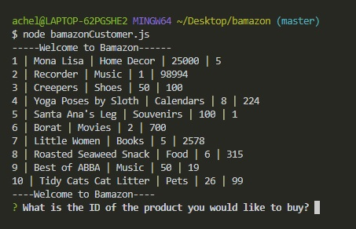
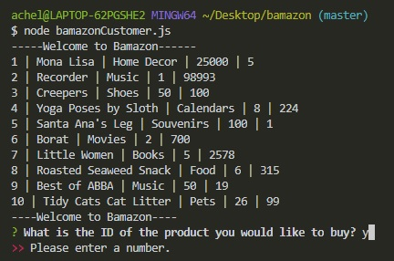
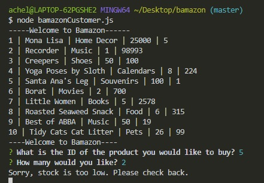
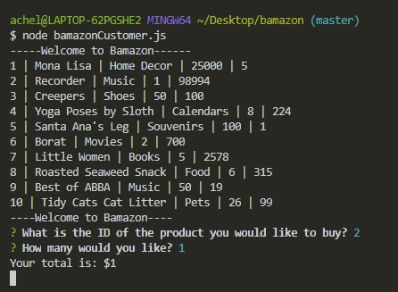
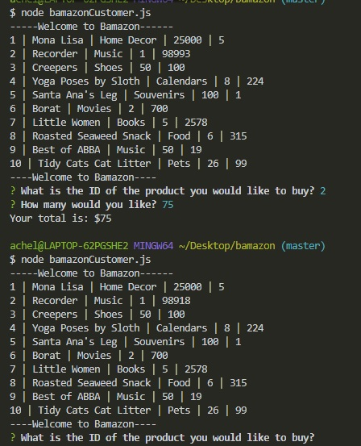

# Bamazon
Bamazon is Amazon-like storefront CLI created using javascript, node and MySQL.

The node app bamazonCustomer.js will take in orders from customers and deplete stock from the store's inventory. The user will be prompted to select the product they would like to buy and the quantity of the purchase. 

If the user enters any character other than a number, they will receive the message "Please enter a number." They must enter an integer for product ID and quantity to purchase.

If the item is in stock the order will be completed and the total amount of the purchase will be logged else "insuffecient stock" will be logged.

After the user has selected a product and quantity of product they would like to purchase, their total will be calculated and printed.

Once the user has successfully made a purchase, the database will update to reflect their purchases removed from stock.

#Technologies Used
Javascript, NodeJS, MYSQL

Node Packages :

mysql
inquirer